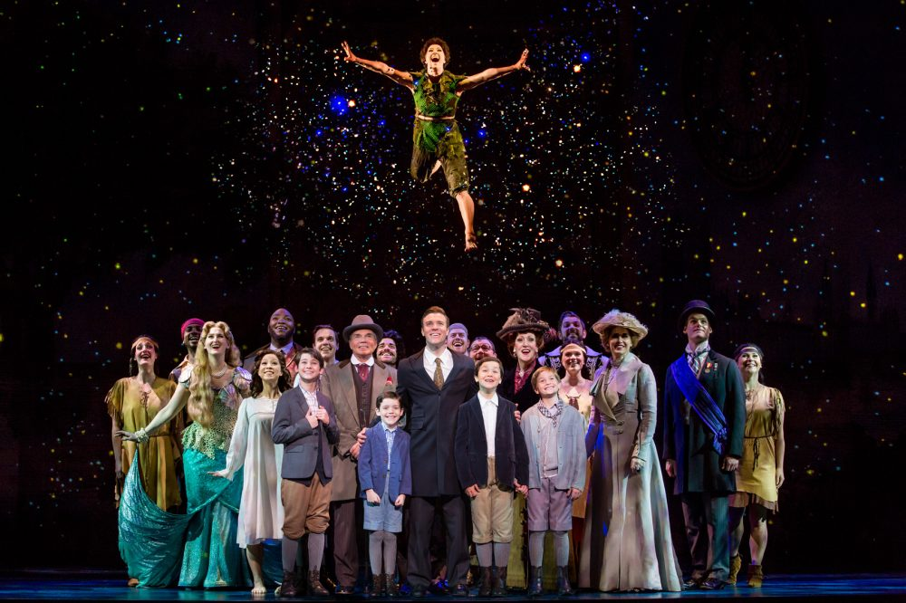

## Content {.columns-2}


- Background information
- Setting up 
- Inspect the data
- Attendance
- Gross
- Random equations
- References

## Background information

- Musical on J.M. Barrie
  + Peter Pan
- Lunt-Fontanne theatre, March 2015 to August 2016
- Cast on Broadway

<center>
{width=70%}
</center>

## Setting up

```{r loading_libraries, warning = F, message = F}
library(tidyverse) # pipes
library(ggplot2) # nice plots
library(DT) # interactive table
library(plotly) # interactive figures
```

The [Broadway dataset](https://corgis-edu.github.io/corgis/csv/broadway/) offers grosses from 1990 to 2016. 

```{r data_loading, warning = F, message = F}
broadway <- read_csv("broadway.csv") # loading in the data

neverland <- broadway %>% 
  filter(Show.Name == "Finding Neverland") # making a subselection
```

For information on any other show exclusively, just swap out the name. For example:
```{r show_not_run, eval = F}
blonde <- broadway %>% 
  filter(Show.Name == "Legally Blonde")
```

## Inspect the data

```{r dataset_table}
datatable(neverland, options = list(pageLength = 5))
```

## Attendance

Let us look at the weekly attendance during its run. 

```{r attendance_plot, cache = T, echo = F, message = F}
# make year a factor
neverland$Year <- as.factor(neverland$Date.Year)
# and the date variable a real date variable
neverland$Date.Full <- as.Date(neverland$Date.Full, "%m/%d/%Y")

# make a scatterplot with the attendance
p <- ggplot(data = neverland, aes(x = Date.Full, y = Statistics.Attendance, color = Year)) +
  geom_point() +
  scale_x_date(date_labels = "%b", date_breaks = "1 month") +
  xlab("Date") +
  ylab("Attendance")

ggplotly(p)
```

## Gross

And then at Finding Neverland's weekly gross. 

```{r gross_plot, cache = T, echo = F, message = F}
# make the gross numbers smaller by dividing by 1000
neverland$gross <- neverland$Statistics.Gross / 1000

# make a scatterplot with the attendance
p <- ggplot(data = neverland, aes(x = Date.Full, y = gross, color = Year)) +
  geom_point() +
  scale_x_date(date_labels = "%b", date_breaks = "1 month") +
  xlab("Date") +
  ylab("Gross (x1000)")

ggplotly(p)
```

## Random equations

I have no place for an equation in this presentation, but since it is required, enjoy these nice equations from my research report. 

The MIMIC model for detecting uniform and non-uniform DIF (Bulut & Suh, 2017):

<center>
$$
\small
\begin{aligned}
y_i^* = \lambda_i\theta + \beta_i z + \omega_i\theta z + \varepsilon_i \\
\end{aligned}
$$
</center>

And the expression for propensity scores and their generation using logistic regression (Liu, Zumbo, Gustafson, Huang, Kroc & Wu, 2016):

<center>
$$
\small
\begin{aligned}
e(\mathbf{X_i}) = P(Z_i = 1 | \mathbf{X_i}) \\
P(Z_i = 1 | \mathbf{X_i}) = \frac{e^{\beta_0 + \mathbf{\beta(x_i)}}}{1 + e^{\beta_0 + \mathbf{\beta(x_i)}}} \\
\end{aligned}
$$
</center>

I am still figuring out what should be bold and what not.

## References

Bart, A.C. (2015). Broadway CSV file. Retrieved from: https://corgis-edu.github.io/corgis/csv/broadway/

Bulut, O., & Suh, Y. (2017). Detecting multidimensional differential item functioning with the multiple indicators multiple causes model, the item response theory likelihood ratio test, and logistic regression. *Frontiers in Education, 2*, 51.

Liu, Y., Zumbo, B., Gustafson, P., Huang, Y., Kroc, E., & Wu, A. (2016). Investigating causal DIF via propensity score methods. *Practical Assessment, Research, and Evaluation, 21* (1), 13.

